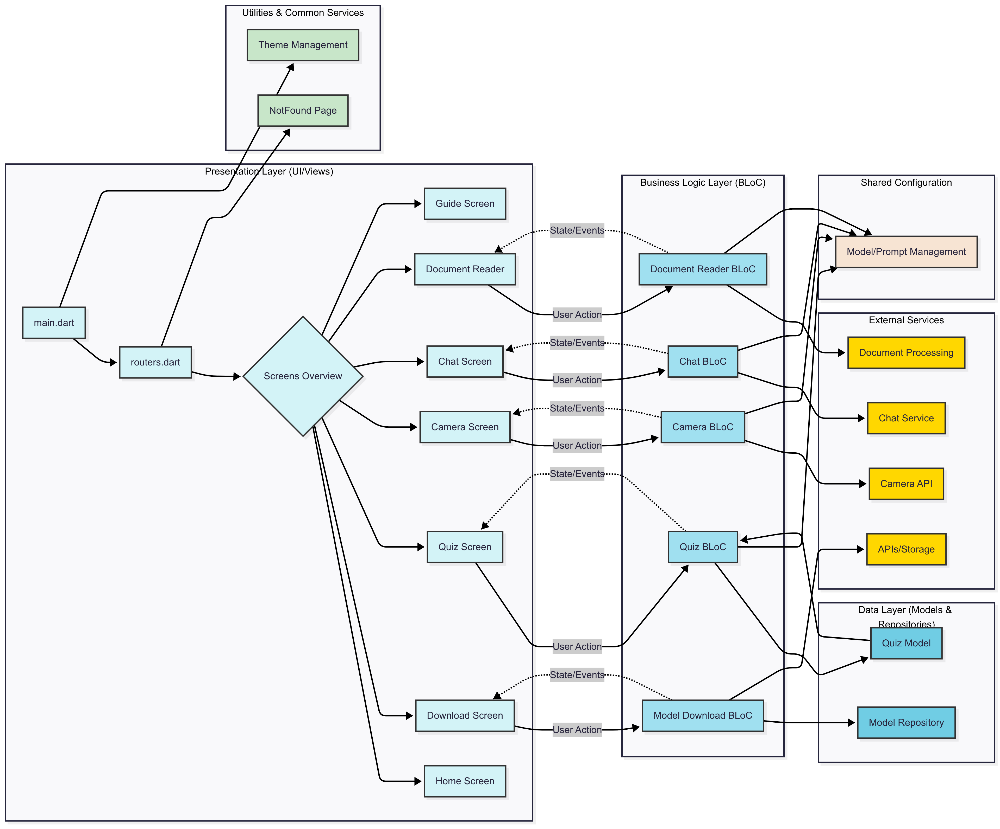

# Bidya AI Education for Unreachable

## Introduction

**Bidya AI Education for Unreachable** is an innovative AI-powered educational platform designed to act as a personalized tutor for students from Class 1 to Class 10. Our mission is to make quality education accessible to those who might otherwise be unreachable, leveraging cutting-edge multi-modal AI capabilities to provide a comprehensive and engaging learning experience.

This project combines a robust Flutter mobile application with sophisticated machine learning pipelines for data preparation, model finetuning, and evaluation, ensuring a seamless and intelligent tutoring system. The goal is to provide tailored education to students, regardless of their geographic location or connectivity limitations.

## System Architecture

The overall system architecture for **Bidya AI Education** is depicted in the `system_architecture.png` file located in the root directory of this project. This diagram illustrates the flow of data and interactions between the mobile application, backend services, and machine learning components.




## Flutter Application Structure

The mobile application, built with **Flutter**, provides the user interface and handles interactions. The core logic and UI components are organized within the `lib` directory as follows:

```plaintext
lib/
├── camera_live/                  # Handles live camera functionalities for multi-modal input
│   ├── camera_bloc.dart
│   ├── camera_event.dart
│   ├── camera_screen.dart
│   └── camera_state.dart
├── chat/                         # Manages the conversational AI tutor interface
│   ├── chat_bloc.dart
│   ├── chat_event.dart
│   ├── chat_screen.dart
│   ├── chat_state.dart
│   └── ChatScreen_old.dart       # Older version of the chat screen (for reference/backup)
├── document_reader/              # Functionality for reading and processing documents
│   ├── document_reader_bloc.dart
│   ├── document_reader_event.dart
│   ├── document_reader_screen.dart
│   └── document_reader_state.dart
├── guide/                        # Application guide or tutorial
│   └── guide.dart
├── home/                         # Main home screen of the application
│   └── home.dart
├── management/                   # Settings and prompt management for the AI model
│   ├── model_settings.dart
│   └── prompt_management.dart
├── model_download/               # Handles the downloading of AI models
│   ├── download_model_bloc.dart
│   ├── download_model_event.dart
│   ├── download_model_state.dart
│   ├── downloadscreen.dart
│   └── model_repository.dart
├── quiz/                         # Manages quiz generation and interaction
│   ├── quiz_bloc.dart
│   ├── quiz_event.dart
│   ├── quiz_model.dart
│   ├── quiz_screen.dart
│   └── quiz_state.dart
├── main.dart                     # Entry point of the Flutter application
├── notFound.dart                 # Handles routes that are not found
├── routers.dart                  # Defines application routing
└── theme.dart                    # Defines the application's visual theme
```

## Finetuning and Data Preparation Files

This folder (`finetuning and data preparation files`) contains the Python code and Jupyter notebooks essential for preparing the educational data, finetuning the **Gemma** model, and evaluating its performance.

```plaintext
finetuning and data preparation files/
├── finetuning_gemma_model.ipynb        # Jupyter notebook containing code for finetuning the Gemma model.
├── getting_prediction.ipynb            # Jupyter notebook that uses a finetuned model checkpoint to generate text predictions. It then produces a CSV file containing ground truth data and the model's responses.
├── metrics_calculation_and_evaluation.ipynb # Jupyter notebook for calculating and evaluating various metrics based on the output CSV from getting_prediction.ipynb.
├── split_data.py                       # Python script to split the dataset into training (80%), validation (10%), and test (10%) sets, ensuring proper distribution according to class and subject.
├── gemma3n.py                          # Python file containing the class definition and structure for the Gemma 3n model.
├── data_preparation.py                 # Python script to convert raw JSON data files into a CSV format suitable for training and finetuning.
├── converting_to_task.ipynb            # Jupyter notebook intended to convert data into a task-specific format. (Note: This currently generates an error due to a lack of direct support for Gemma 3n conversion.)
└── convert_gemma3n_to_tflite           # Script/file for converting the Gemma 3n model to TFLite format. (Note: This also currently lacks direct support and will generate an error.)
```
### Key Components

- **Finetuning and Model Files**: The `.ipynb` and `.py` files in the `finetuning and data preparation files/` directory handle all the stages of data preparation, model finetuning, and model evaluation.

- **Model & Data Handling**: The `split_data.py` script is crucial for creating training, validation, and test sets, ensuring that the dataset is well-prepared for model training. The `gemma3n.py` file is responsible for defining the structure of the **Gemma 3n** model.

- **Model Conversion**: While **Gemma 3n** does not yet support conversion to TFLite, the `convert_gemma3n_to_tflite` script is in place for future updates or model conversions when compatibility is achieved.

## Project Contributors

- **Jeshan Pokharel**: jeshanpokharel123@gmail.com
- **Nischal Acharya**: nischalacharya642@gmail.com